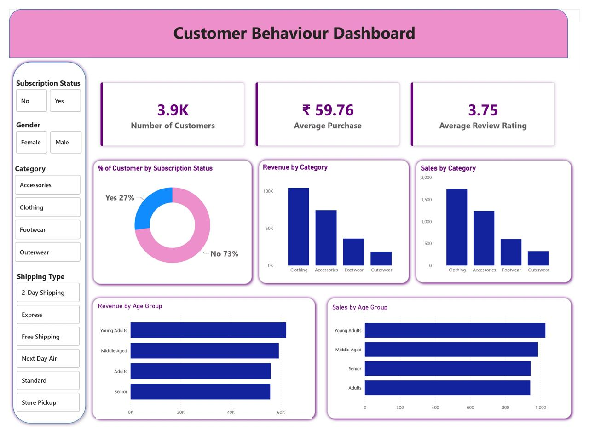

# 🛍️ Customer Shopping Behavior Analysis – Retail Customer Analytics

_Analyzing customer shopping behavior to uncover revenue drivers, loyalty patterns, and pricing/discount dynamics using SQL, Python, and Power BI._

---

## 📌 Table of Contents
- <a href="#overview">Overview</a>
- <a href="#business-problem">Business Problem</a>
- <a href="#dataset">Dataset</a>
- <a href="#tools--technologies">Tools & Technologies</a>
- <a href="#project-structure">Project Structure</a>
- <a href="#data-cleaning--preparation">Data Cleaning & Preparation</a>
- <a href="#exploratory-data-analysis-eda">Exploratory Data Analysis (EDA)</a>
- <a href="#research-questions--key-findings">Research Questions & Key Findings</a>
- <a href="#dashboard">Dashboard</a>
- <a href="#how-to-run-this-project">How to Run This Project</a>
- <a href="#final-recommendations">Final Recommendations</a>
- <a href="#author--contact">Author & Contact</a>

---
<h2><a class="anchor" id="overview"></a>Overview</h2>

This project analyzes 3,900 customer transactions to understand shopping behavior and drive strategic decisions on marketing spend, subscription program design, inventory planning, and discount strategy. A complete data pipeline was built using Python for data cleaning and feature engineering, MySQL for business-question querying, and Power BI for interactive visualization.

---
<h2><a class="anchor" id="business-problem"></a>Business Problem</h2>

Understanding what drives customer spend and loyalty is critical for retail growth. This project aims to:
- Identify which customer segments, products, and categories generate the most revenue
- Determine whether subscription enrollment is linked to higher spend
- Evaluate whether repeat buyers are being converted into subscribers
- Analyze discount penetration and its relationship to order value
- Segment customers by loyalty tier to inform retention strategy

---
<h2><a class="anchor" id="dataset"></a>Dataset</h2>

- `data/customer_shopping_behavior.csv` — 3,900 transactions, 18 columns
- Fields include customer demographics (age, gender, location), product attributes (item, category, size, color, season), transaction details (purchase amount, discount applied, promo code, payment method, shipping type), and behavioral history (previous purchases, purchase frequency, subscription status, review rating)
- Cleaned table loaded into a MySQL database (`customer_behaviour`) and used as the single source for all analysis

---

<h2><a class="anchor" id="tools--technologies"></a>Tools & Technologies</h2>

- Python (Pandas, SQLAlchemy)
- SQL (Aggregations, CASE Logic, Subqueries, CTEs, Window Functions)
- Power BI (Interactive Visualizations)
- Jupyter Notebook
- GitHub

---
<h2><a class="anchor" id="project-structure"></a>Project Structure</h2>

```
customer-shopping-behavior-analysis/
│
├── README.md
├── .gitignore
├── requirements.txt
├── Customer Shopping Behavior Analytics Report.docx
│
├── data/
│   └── customer_shopping_behavior.csv
│
├── notebooks/
│   └── Analysis.ipynb          # Data cleaning, feature engineering, MySQL load
│
├── sql/
│   └── customer_behaviour_queries.sql   # 10 business-question queries
│
├── dashboard/
│   └── Customer_behaviour_Dashboard.pbix
```

---
<h2><a class="anchor" id="data-cleaning--preparation"></a>Data Cleaning & Preparation</h2>

- Handled missing `Review Rating` values (0.9% of rows) using the **category-level median** rather than a single global median, since ratings vary by product type
- Standardized column names to `snake_case` for SQL compatibility (e.g. `Purchase Amount (USD)` → `purchase_amount`)
- Removed `promo_code_used`, a redundant column found to be identical to `discount_applied` in every row
- Engineered new features:
  - `age_group` — quartile-based segmentation (Young Adults, Adults, Middle Aged, Senior)
  - `frequency_purchase_days` — mapped purchase-frequency labels (e.g. "Weekly", "Quarterly") to an approximate day-count
- Loaded the cleaned dataset into MySQL via SQLAlchemy for structured querying

---
<h2><a class="anchor" id="exploratory-data-analysis-eda"></a>Exploratory Data Analysis (EDA)</h2>

**Dataset Overview:**
- 3,900 rows × 18 columns, no duplicate transactions
- Average order value: $59.76 | Average review rating: 3.75 / 5

**Missing Values:**
- `Review Rating`: 37 missing values (0.9%) — imputed by category median

**Key Distributions:**
- Revenue is concentrated in **Clothing** (44.7%) and **Accessories** (31.8%)
- Customer base skews heavily **Loyal** (79.9% have 10+ previous purchases)
- Only **27%** of customers are enrolled in the subscription program
- **43%** of all orders have a discount applied

---
<h2><a class="anchor" id="research-questions--key-findings"></a>Research Questions & Key Findings</h2>

1. **Revenue by Category**: Clothing leads with $104,264 (44.7%), followed by Accessories at $74,200 (31.8%)
2. **Revenue by Gender**: Male customers drive 68% of revenue, but average order value is nearly identical across genders — the gap is a customer-acquisition issue, not a spend issue
3. **Top-Rated Products**: Gloves (3.86), Sandals (3.84), and Boots (3.82) received the highest average review ratings
4. **Shipping & Order Value**: Average order value is consistent across shipping methods (within ~4%), so shipping choice doesn't correlate with basket size
5. **Subscribers vs. Non-Subscribers**: Subscribers spend **$59.49** per order vs. **$59.87** for non-subscribers — subscription status does *not* currently predict higher spend
6. **Discount Penetration**: Hat (50.0%), Sneakers (49.7%), and Coat (49.1%) are discounted in roughly half of all transactions
7. **Customer Segmentation**: 79.9% Loyal, 16.1% Returning, 4.0% New (by previous purchase count)
8. **Repeat Buyers & Subscriptions**: Of customers with 5+ previous purchases, only **27.6%** are subscribed — nearly identical to the overall subscription rate, revealing a large untapped conversion opportunity
9. **Top Products per Category**: Order volumes are tightly clustered within each category, indicating broad-based demand rather than dependence on a few hero SKUs
10. **Revenue by Age Group**: Evenly distributed across quartiles (Young Adults highest at $62,143, Seniors lowest at $55,763) — age is not a strong differentiator of spend

---
<h2><a class="anchor" id="dashboard"></a>Dashboard</h2>

- Power BI Dashboard shows:
  - Revenue by Category, Gender, and Age Group
  - Subscriber vs. Non-Subscriber Spend Comparison
  - Customer Loyalty Segmentation
  - Discount Penetration & Shipping Method Trends



---
<h2><a class="anchor" id="how-to-run-this-project"></a>How to Run This Project</h2>

1. Clone the repository:
```bash
git clone https://github.com/yourusername/customer-shopping-behavior-analysis.git
```
2. Install dependencies:
```bash
pip install -r requirements.txt
```
3. Open and run the notebook to clean the data and load it into MySQL:
   - `notebooks/Analysis.ipynb`
4. Run the business-question queries against the `customer_behaviour` database:
   - `sql/customer_behaviour_queries.sql`
5. Open the Power BI Dashboard:
   - `dashboard/Customer_behaviour_Dashboard.pbix`

---
<h2><a class="anchor" id="final-recommendations"></a>Final Recommendations</h2>

- Launch a targeted subscription campaign aimed at proven repeat buyers (5+ previous purchases) who are not yet subscribed
- Reposition the subscription program around retention and purchase frequency rather than basket size
- Audit discount economics on high-penetration products (Hat, Sneakers, Coat, Sweater, Pants) to confirm discounts drive incremental volume
- Prioritize acquisition marketing toward female customers to close the revenue gap driven by customer count, not spend per order
- Treat shipping tier as a cost-to-serve and satisfaction decision, not a revenue lever

---
<h2><a class="anchor" id="author--contact"></a>Author & Contact</h2>

**Sufiyan Manihar**
Data Analyst
📧 Email: sufiyanmanihar533@gmail.com
🔗 [LinkedIn](www.linkedin.com/in/sufiyan-manihar-b77290374)

